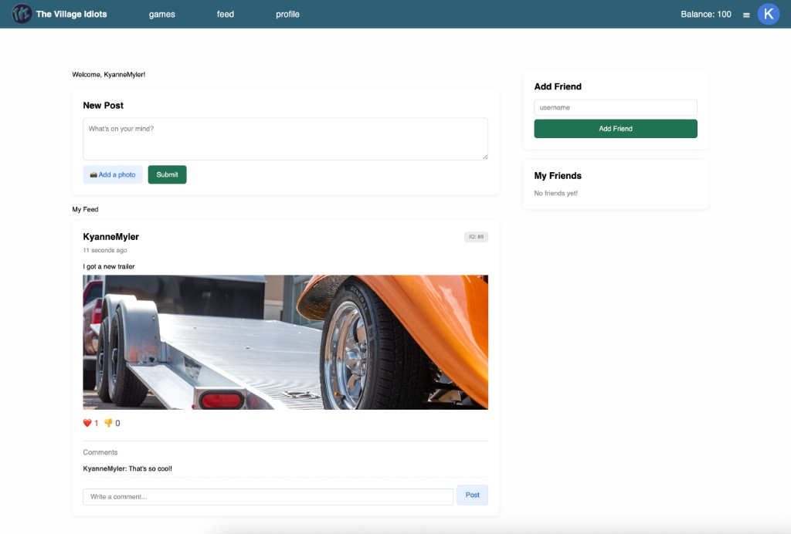
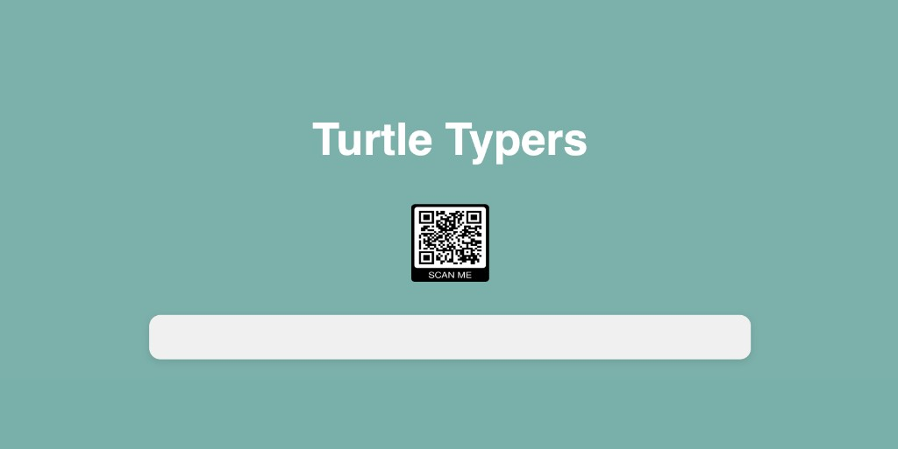

# YouFace

## Overview

YouFace is a Flask web app that implements a lightweight social feed: users sign in, publish posts (text and photos), react with likes and dislikes, comment on posts, and add friends by username. The interface includes personalized themes, a points balance, profile IQ on posts, and navigation for feed, profile, and games—similar to a small social or “dating app” style product.

The codebase started as a course baseline (CS 1410 → CS 2450): it is intentionally minimal so groups can extend branding, features, and data models. Working in this repo is practice reading an existing stack (Flask, Jinja, TinyDB) without exhaustive docs—common in real projects. If something is unclear, ask and we can improve the documentation in targeted spots.

## Screenshot

Feed view (posts, comments, reactions, and friends sidebar):



### Turtle Typers (games landing example)

Example games-area branding: a simple landing with title, “scan me” QR code, and entry field—useful as inspiration when customizing `/games` or adding a mobile join flow.



## Getting Started

### Installing Requirements

The requirements are listed in `requirements.txt`. With `pip`, they can be
easily installed in one command:

`pip3 install -r requirements.txt`

### Running the Server

The server main is found in `youface.py`. It requires Python 3 and can be run
with the following command:

`python3 youface.py`

By default the app listens on port **5001** (port 5000 is often used by macOS AirPlay). Open `http://127.0.0.1:5001`. To use another port, set the `PORT` environment variable (for example `PORT=8080 python3 youface.py`).

Press `CTRL+C` to stop the server

## Development

### File Tree

```
.
├── docs
│   ├── feed-screenshot.png
│   └── turtle-typers-screenshot.png
├── db
│   ├── posts.py
│   └── users.py
├── db.json
├── handlers
│   ├── copy.py
│   ├── friends.py
│   ├── login.py
│   ├── posts.py
├── README.md
├── requirements.txt
├── static
│   ├── bootstrap.min.css
│   └── youface.css
├── templates
│   ├── base.html
│   ├── feed.html
│   ├── friend.html
│   ├── login.html
│   └── nav.html
├── tests
│   └── test_login.py
└── youface.py
```

### External Libraries

The following external libraries were used to help make this project. Please
refer to their documentation frequently. It will be more useful to you to check
with the documentation before you search Google/StackOverflow. In fact, the more
you practice referencing official documentation, the quicker you'll get at it.
You might eventually find yourself not relying on StackOverflow near as much as
before. I'll include some links with helpful tutorials as well.

- [Flask](https://palletsprojects.com/p/flask/)
    - https://pythonhow.com/flask-navigation-menu/
    - https://blog.miguelgrinberg.com/post/the-flask-mega-tutorial-part-iii-web-forms
    - https://blog.pythonanywhere.com/121/
- [jinja](https://jinja.palletsprojects.com/en/2.11.x/)
    - https://jinja.palletsprojects.com/en/2.11.x/tricks/
    - https://realpython.com/primer-on-jinja-templating/
- [TinyDB](https://pypi.org/project/tinydb/)
    - https://tinydb.readthedocs.io/en/latest/
    - See examples in dbhelpers.py
- [timeago](https://pypi.org/project/timeago/)

### Database Documents (Objects)

Users

| Key | Type | Description |
| --- | ------ | --- |
| id | int | The user's unique identifier. |
| username | str | The user's unique username. |
| password | str | The user's password. |
| friends | []int | A list of user ids for this user's friends. |

Posts

| Key | Type | Description |
| --- | ------ | --- |
| id | int | The post's unique identifier. |
| user | str | The username of the post creator. |
| text | str | The text of the post. |
| time | float | The timestamp for when the post was created. |

### Running the Tests

Run all the tests in the `tests` directory:

```
python3 -m unittest discover -vs tests
```

Run a specific test file (e.g., `tests/test_login.py`:

```
python3 -m unittest tests.test_login
```
